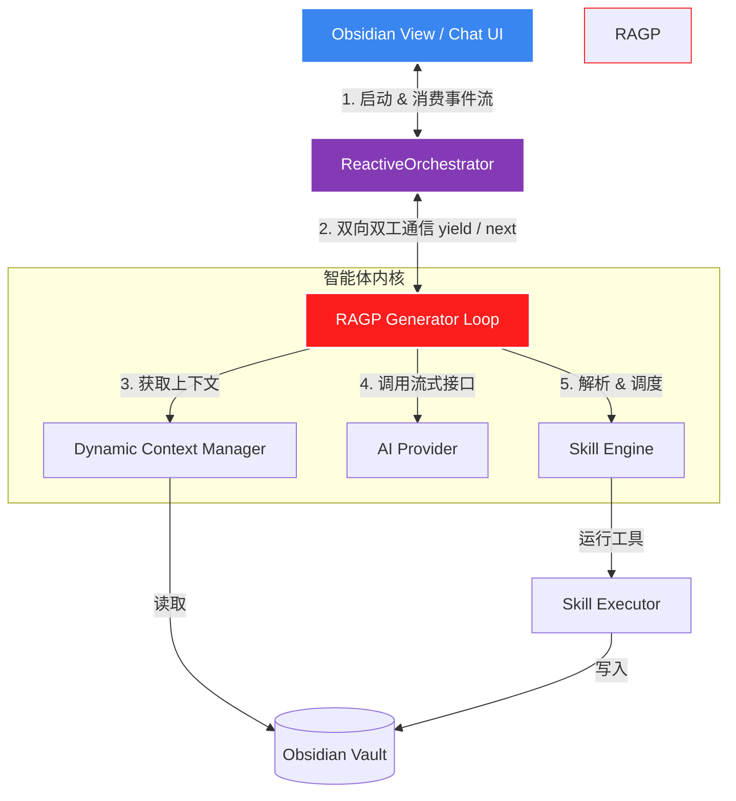

# RAGP (Reactive Async-Generator Pipeline) 智能体架构设计方案

本设计方案旨在为 `personal-agent` 提供一套极轻量、响应式、完全可控且深度契合 Obsidian 沙盒环境的自主 AI 智能体（Agent）架构。

该架构通过 JavaScript/TypeScript 原生的**异步生成器（Async Generators）**和**双向事件驱动流**，实现高频人机交互（Human-in-the-Loop）、精细状态感知和极速流式渲染。

---

## 1. 架构概览 (Mermaid 拓扑)



---

## 2. 核心状态与事件定义 (`types.ts`)

为了让智能体与 UI 能够进行“像素级”的交互沟通，我们定义了一套精细的**心跳与事件流规范**：

```typescript
/**
 * 智能体运行过程中的所有状态心跳事件
 */
export type AgentEvent =
  // 1. 全局状态提示
  | { type: 'status'; message: string }
  
  // 2. LLM 回复文本的流式字元 (Token Chunks)
  | { type: 'chunk'; text: string }
  
  // 3. 技能/工具运行周期
  | { type: 'skill_call'; name: string; params: any }
  | { type: 'skill_success'; name: string; result: any }
  | { type: 'skill_error'; name: string; error: string }
  
  // 4. 人机交互：二次确认请求
  | { 
      type: 'confirm_request'; 
      skillName: string; 
      params: any; 
      message: string; 
    }
  
  // 5. 错误提示
  | { type: 'error'; message: string };

/**
 * 智能体最终的输出响应
 */
export interface AgentResponse {
  content: string;
  messages: ChatMessage[];
  skillCalls: SkillCall[];
  metadata: {
    turns: number;
    durationMs: number;
  };
}
```

---

## 3. RAGP 内核生成器流程 (`Generator`)

核心状态机采用 **`async function*`** 实现。它接收初始参数，通过 `yield` 吐出 `AgentEvent` 给 UI，同时通过 `yield` 的返回值挂起等待外部输入（如人机交互确认）。

```typescript
export interface RAGPState {
  messages: ChatMessage[];
  systemPrompt: string;
  maxTurns: number;
  turnCount: number;
  fullResponse: string;
  skillCalls: SkillCall[];
  skills: any[];
}

export class ReactiveAgent {
  // ... 依赖注入 SkillRegistry, SkillExecutor, Provider 等

  /**
   * 核心异步生成器执行循环
   * @param prompt 用户初始输入
   * @param context 历史上下文
   */
  async *execute(
    prompt: string, 
    context: AgentContext
  ): AsyncGenerator<AgentEvent, AgentResponse, any> {
    const startTime = Date.now();
    
    // 1. 初始化状态
    const state: RAGPState = {
      messages: [
        ...context.messages,
        { role: 'user', content: prompt, timestamp: Date.now() }
      ],
      systemPrompt: await this.buildSystemPrompt(),
      maxTurns: 10,
      turnCount: 0,
      fullResponse: '',
      skillCalls: [],
      skills: this.getToolDefinitions()
    };

    yield { type: 'status', message: '正在分析您的指令...' };

    // 2. 状态迭代多轮循环 (LLM -> Tool -> LLM)
    while (state.turnCount < state.maxTurns) {
      state.turnCount++;
      
      yield { type: 'status', message: `正在思考 (第 ${state.turnCount} 轮)...` };

      // 节点 A: 调用大模型流式生成
      let turnContent = '';
      let toolCalls: ToolCall[] = [];
      
      try {
        const response: GenerateResponse = await this.provider.generateStreamWithSkills!(
          state.messages,
          (chunk: string) => {
            turnContent += chunk;
          },
          (tc: ToolCall) => {
            toolCalls.push(tc);
          },
          {
            systemPrompt: state.systemPrompt,
            skills: state.skills,
            temperature: 0.7
          }
        );
        
        yield { type: 'chunk', text: turnContent };
        
      } catch (err: any) {
        yield { type: 'error', message: `大模型请求异常: ${err.message}` };
        throw err;
      }

      const assistantMessage: ChatMessage = {
        role: 'assistant',
        content: turnContent,
        timestamp: Date.now(),
        tool_calls: toolCalls.length > 0 ? toolCalls : undefined
      };
      state.messages.push(assistantMessage);
      state.fullResponse += turnContent;

      if (toolCalls.length === 0) {
        break;
      }

      // 节点 B: 工具执行
      for (const toolCall of toolCalls) {
        const skill = this.skillRegistry.get(toolCall.name);
        const requiresConfirmation = skill?.metadata?.requiresConfirmation;

        let executeApproved = true;

        if (requiresConfirmation) {
          yield { type: 'status', message: `等待授权: ${toolCall.name}` };
          
          // Generator 在这里挂起，向 UI 抛出确认事件，并通过 yield 获取用户反馈
          const userFeedback: { approved: boolean; modifiedParams?: any } = yield {
            type: 'confirm_request',
            skillName: toolCall.name,
            params: toolCall.arguments,
            message: `智能体申请执行操作: 【${skill.metadata.description}】。是否批准？`
          };

          executeApproved = userFeedback.approved;
          if (userFeedback.modifiedParams) {
            toolCall.arguments = userFeedback.modifiedParams;
          }
        }

        if (!executeApproved) {
          yield { type: 'status', message: `用户已拒绝执行: ${toolCall.name}` };
          state.messages.push({
            role: 'tool',
            content: 'Error: Execution cancelled by the user.',
            timestamp: Date.now(),
            tool_call_id: toolCall.id,
            name: toolCall.name
          });
          continue;
        }

        yield { type: 'skill_call', name: toolCall.name, params: toolCall.arguments };
        
        try {
          const result = await this.skillExecutor.executeFromToolCall(toolCall);
          
          if (result.success) {
            yield { type: 'skill_success', name: toolCall.name, result: result.data };
            state.messages.push({
              role: 'tool',
              content: JSON.stringify(result.data, null, 2),
              timestamp: Date.now(),
              tool_call_id: toolCall.id,
              name: toolCall.name
            });
          } else {
            yield { type: 'skill_error', name: toolCall.name, error: result.error || '执行失败' };
            state.messages.push({
              role: 'tool',
              content: `Error: ${result.error || 'Execution failed'}`,
              timestamp: Date.now(),
              tool_call_id: toolCall.id,
              name: toolCall.name
            });
          }
        } catch (execErr: any) {
          yield { type: 'skill_error', name: toolCall.name, error: execErr.message };
          state.messages.push({
            role: 'tool',
            content: `Error: Exception during execution: ${execErr.message}`,
            timestamp: Date.now(),
            tool_call_id: toolCall.id,
            name: toolCall.name
          });
        }
      }
    }

    yield { type: 'status', message: '任务完成！' };

    return {
      content: state.fullResponse,
      messages: state.messages,
      skillCalls: state.skillCalls,
      metadata: {
        turns: state.turnCount,
        durationMs: Date.now() - startTime
      }
    };
  }
}
```

---

## 4. 人机交互 (Human-in-the-Loop) 执行序列

当遇到高风险 Skill（如删除文件、执行 Shell 脚本）时，RAGP 的双向状态同步如下图流转：

```
[ UI 层 (Obsidian Chat View) ]                [ RAGP 智能体内核 ]
            |                                         |
            | ---------- 1. 触发执行 ----------------> | (开始迭代)
            |                                         | (模型返回高风险 Tool)
            | <--------- 2. yield 'confirm_request' - | (Generator 挂起暂停)
            |                                         |
     (弹窗询问用户)                                    |
  [确认] / [修改参数]                                  |
            |                                         |
            | ---------- 3. next({ approved: true }) ->| (Generator 恢复)
            |                                         | (继续执行 Skill)
            | <--------- 4. yield 'skill_success' --- | (返回运行成功)
```

---

## 5. UI 侧（Svelte/React）如何极简消费此架构？

这套架构最大的优势之一是它对**前端交互的极度友好**。在 UI 组件的事件响应中：

```typescript
async function handleSendQuery(userQuery: string) {
  chatMessages.update(list => [...list, { role: 'user', content: userQuery }]);

  const agent = plugin.reactiveAgent;
  const stream = agent.execute(userQuery, { messages: $chatMessages });

  try {
    let currentEvent = await stream.next();

    while (!currentEvent.done) {
      const event = currentEvent.value as AgentEvent;

      switch (event.type) {
        case 'status':
          uiStatusText.set(event.message); // 渲染“AI 正在做什么”的动态状态
          break;

        case 'chunk':
          chatMessages.update(list => {
            const last = list[list.length - 1];
            if (last && last.role === 'assistant') {
              return [...list.slice(0, -1), { ...last, content: last.content + event.text }];
            } else {
              return [...list, { role: 'assistant', content: event.text }];
            }
          });
          break;

        case 'confirm_request':
          // 渲染交互确认弹窗，阻塞式等待用户点击
          const userChoice = await showInteractiveModal({
            title: `高风险技能授权: ${event.skillName}`,
            body: event.message,
            originalParams: event.params
          });

          // 将用户的确认和修改完的参数喂回智能体，恢复执行
          currentEvent = await stream.next(userChoice);
          continue;

        case 'skill_call':
          activeRunningTools.update(set => { set.add(event.name); return set; });
          break;

        case 'skill_success':
          activeRunningTools.update(set => { set.delete(event.name); return set; });
          showNotification(`✓ ${event.name} 运行成功`);
          break;
      }

      currentEvent = await stream.next();
    }

    const finalResponse = currentEvent.value as AgentResponse;
    console.log('Agent Execution Completed:', finalResponse);

  } catch (error) {
    showNotification('智能体执行异常，请检查日志。', 'error');
  }
}
```

---

## 6. RAGP 带来的工程收益

1.  **极度清爽的代码结构**：消除了 Promise 手动阻塞与嵌套事件分发，利用 `yield` 将高频交互扁平化。
2.  **完美的 Obsidian API 兼容性**：完全依托主线程/渲染线程的事件循环，安全同步地访问 active notes，免受生命周期隔离困扰。
3.  **零依赖、轻量打包**：完全自主掌控，不增加一克 npm 依赖，利于 esbuild 快速 tree-shake 与 bundle。
